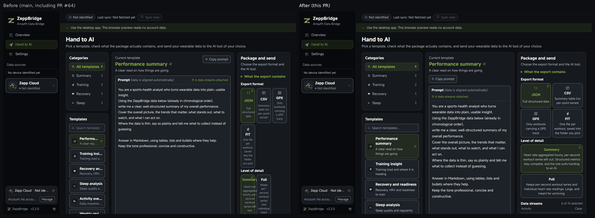
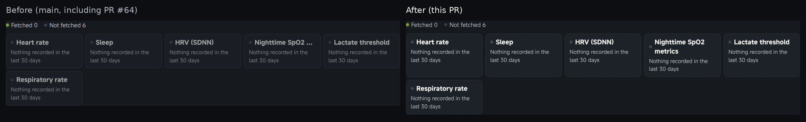
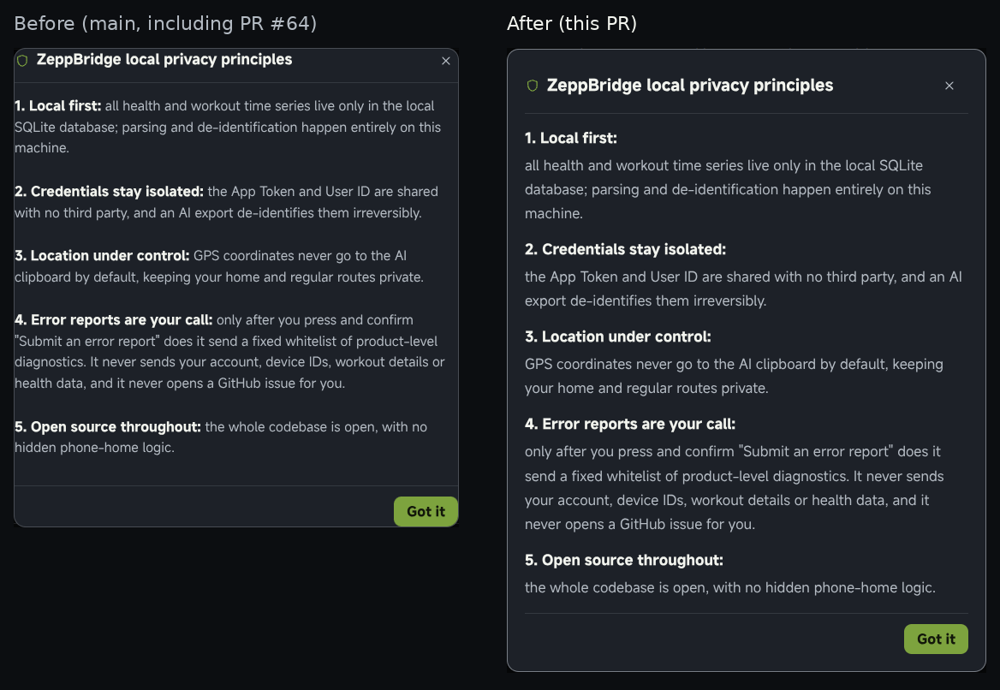

# Readability follow-up to PR #64

[PR #64](https://github.com/lingcang728/ZeppBridge/pull/64) changed 37 files and already established the shared type scale, darker surfaces, brighter supporting text and non-colour status cues. This follow-up keeps those tokens and concentrates on choosing templates, reading settings and using shared controls.

The **Before** screenshots use `f820cf2`, which already includes #64. Both sides are captured at 1440 × 1000 in Chromium, English, 100% interface scale. These are the actual Vue pages in browser preview. The capability board uses six test-only `no_records` entries to expose missing-data explanations; no account or health readings were used. These are visual checks, not proof of native WebView or screen-reader compatibility.

## Hand to AI

Template names and descriptions wrap, the editor uses the body text size, and format descriptions are easier to read. The three columns wrap according to their available width so interface zoom cannot squeeze the editor into a sliver. The format and detail choices adapt their columns to the copy.

## Missing-data explanations

The previous `.62` container opacity dimmed every label and explanation. Missing-data cards now retain the shared text colours, use a dashed boundary and allow long metric names to wrap. Archive continuation guidance also uses an explicit text colour instead of opacity.

## Privacy and release notes

Privacy prose uses the body text size with distinct paragraph headings. Both settings dialogs share a labelled modal, keyboard focus containment, Escape dismissal and focus restoration. A bounded scrolling panel keeps the footer reachable in short windows. Close buttons are labelled and 44 × 44 CSS pixels.

## Verification

- Production frontend build; 109 existing frontend tests; 33 Pages-function/capability tests; bundle, i18n, documentation and version checks.
- Browser interaction checks: template selection state, search/editor focus outlines, dropdown ID references and active option, Home/End/Enter/Escape/Tab, mouse selection, modal Tab/Shift+Tab wrapping, Escape/backdrop dismissal and restored focus.
- A stationary pointer no longer overrides keyboard option navigation when the dropdown scrolls; hover selection responds to pointer movement.
- Long test-only update notes scroll and dismiss without installing an update.
- English and Chinese at 1440 × 1000 / 100%, 1280 × 720 / 125%, 760 × 720 / 100%, 390 × 844 / 100% and 320 × 640 / 100%: checked template/format/editor/summary text for overflow and privacy-dialog footer reachability. No page exceptions were observed in these checks.

Native Windows/macOS/Linux execution and spoken output with NVDA/VoiceOver are outside the local browser checks. The PR runs the repository's existing platform CI.

Interaction references: [WAI-ARIA combobox pattern](https://www.w3.org/WAI/ARIA/apg/patterns/combobox/) and [modal dialog pattern](https://www.w3.org/WAI/ARIA/apg/patterns/dialog-modal/).
